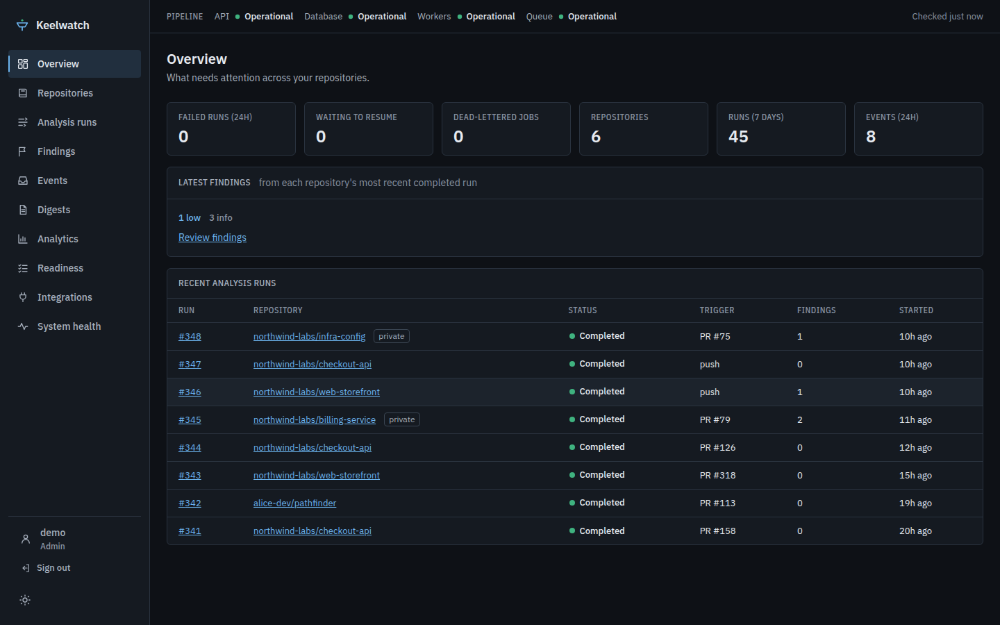
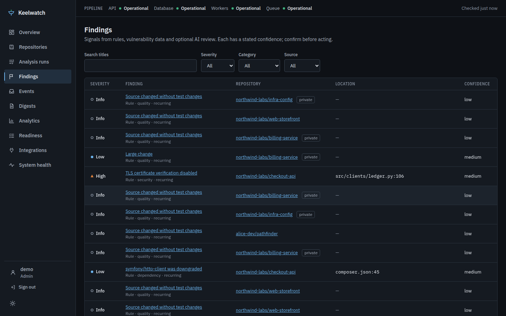
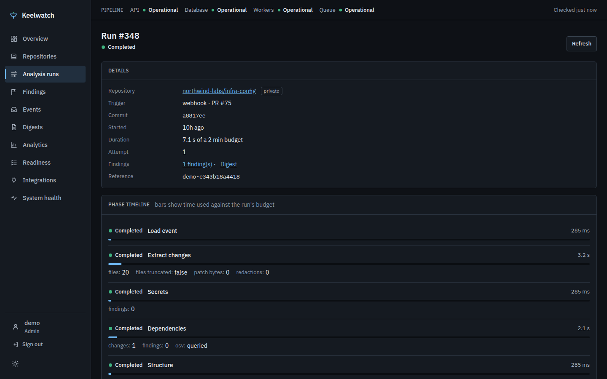
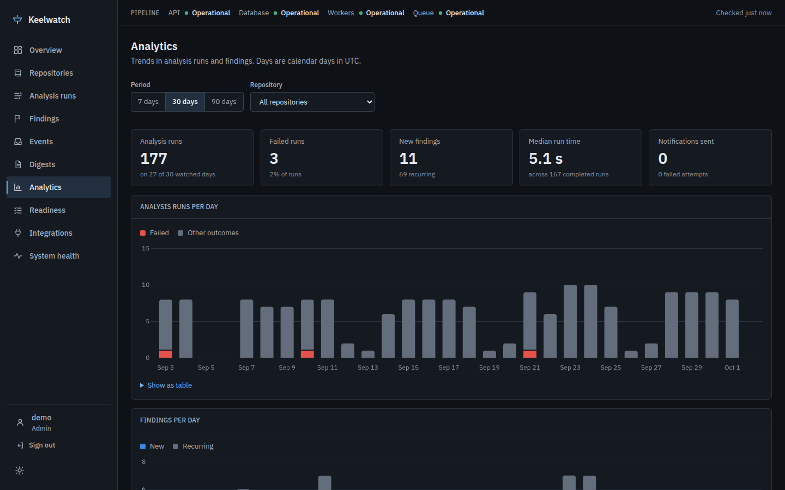
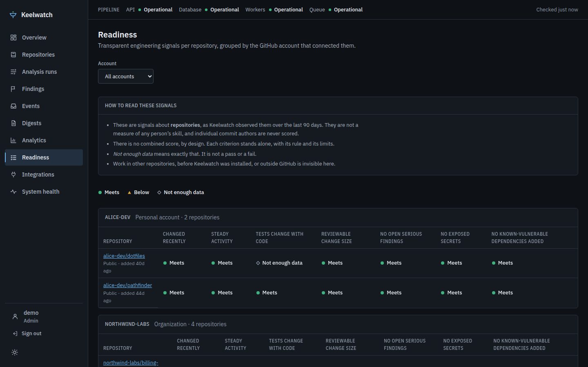
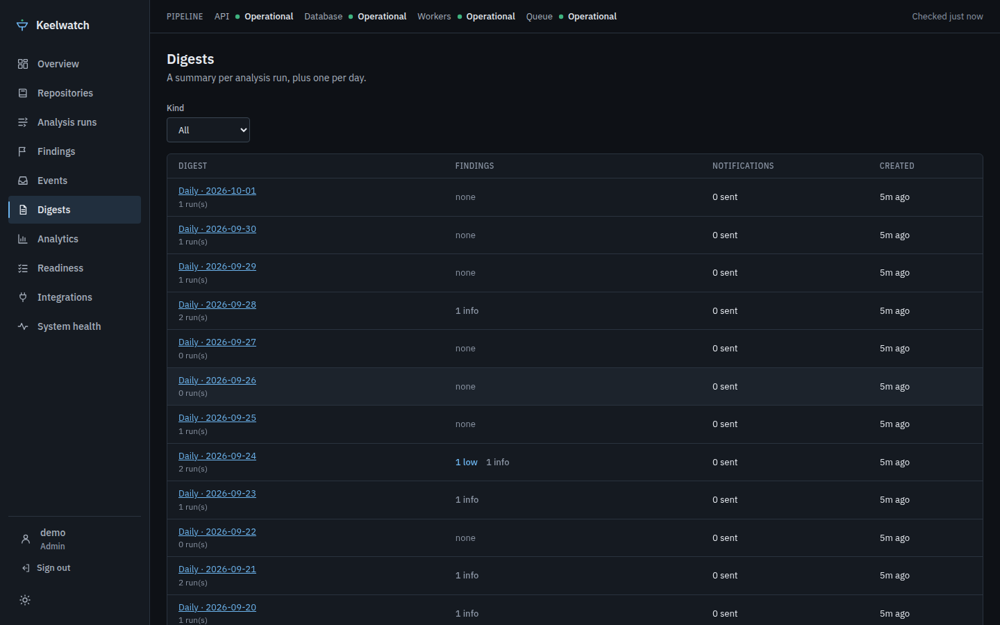
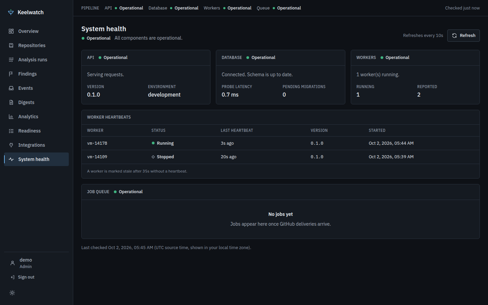
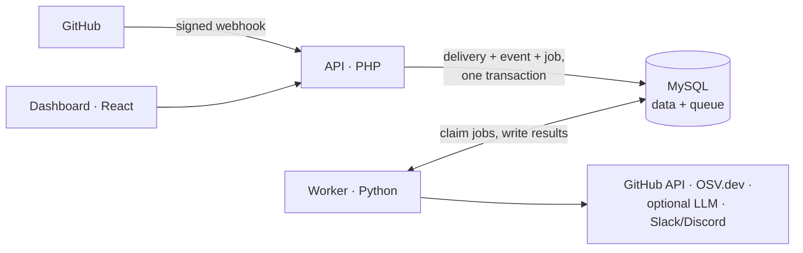

# Keelwatch

[](https://github.com/fazal305/keelwatch/actions/workflows/ci.yml)
[](LICENSE)

Keelwatch turns GitHub repository activity into evidence-backed engineering
signals. Every push and pull request is analysed in the background for
exposed secrets, risky dependency changes, known-vulnerable versions and
hard-to-review changes. The results become findings, digests, trends and
readiness checklists on a self-hosted dashboard, with optional Slack or
Discord notifications.

<picture>
  <source media="(prefers-color-scheme: light)" srcset="docs/screenshots/overview-light.png">
  
</picture>

## What it does

- **Ingests GitHub webhooks safely.** HMAC-verified, deduplicated by delivery
  ID, and committed to the database together with its job before GitHub gets
  a response. Analysis never runs in the request path.
- **Analyses every change.** Exposed credentials and sensitive files, insecure
  patterns, dependency changes (URL sources, unbounded ranges, downgrades),
  known vulnerabilities from [OSV.dev](https://osv.dev), and change-size and
  test-coverage heuristics. An LLM review is optional and off by default.
- **Survives interruptions.** Each run has a time budget and checkpoints
  after every phase, so rate limits, outages and restarts resume a run
  instead of repeating or losing it.
- **Says what it didn't check.** Every digest lists its gaps. An OSV outage
  reads "lookup unavailable", never "no vulnerabilities".
- **Explains its signals.** Findings carry a confidence, evidence and
  provenance (rule, OSV or model). Readiness checklists show the rule and its
  limits next to each result, and there is no combined score.

What it is **not**: a replacement for code review, a SAST suite, or a measure
of any developer's ability. Findings are signals to confirm, not verdicts.

## Screens

| | |
| --- | --- |
| [](docs/screenshots/findings-dark.png) **Findings:** filter by severity, category and source; new vs recurring | [](docs/screenshots/run-detail-dark.png) **Run detail:** phase timeline against the run's budget; resume or cancel |
| [](docs/screenshots/analytics-dark.png) **Analytics:** 7/30/90-day trends, each with a table view | [](docs/screenshots/readiness-dark.png) **Readiness:** seven transparent criteria per repository |
| [](docs/screenshots/digests-dark.png) **Digests:** per run and per day, with gaps | [](docs/screenshots/system-health-dark.png) **System health:** API, database, worker heartbeats, queue |

Screenshots show fictional sample data from `scripts/seed_demo.py`. Light-theme
versions are in [`docs/screenshots/`](docs/screenshots/).

## How it works



The API accepts and verifies webhooks and serves the dashboard. The worker
claims jobs from a MySQL-backed queue (`SELECT … FOR UPDATE SKIP LOCKED`),
runs the analysis pipeline, and stores findings and digests. There is no
message broker: at the expected volume, the database queue is simpler to
operate and gives a transactional enqueue.

Read more in [docs/architecture.md](docs/architecture.md) and the decision
records in [docs/adr/](docs/adr/).

| Path | What it is |
| --- | --- |
| `api/` | PHP 8.4 API: webhook ingestion, dashboard JSON API, sign-in, migrations |
| `worker/` | Python 3.12 worker: job queue, analysis pipeline, digests, notifications |
| `web/` | React 19 + Vite dashboard |
| `db/migrations/` | Numbered MySQL migrations, applied only by the API |
| `contracts/` | JSON Schemas and fixtures shared by the PHP and Python test suites |
| `bench/` | Benchmarks (test database only); results in [docs/performance.md](docs/performance.md) |
| `scripts/` | Signed test webhooks and the sample-data seeder |
| `deploy/`, `compose.yaml` | Container images, Caddy config, backup and restore scripts |

## Quick start

Requirements: PHP 8.4 (`pdo_mysql`, `mbstring`) with Composer, Python 3.12,
Node.js 24, MySQL 8.4.

```bash
git clone https://github.com/fazal305/keelwatch.git && cd keelwatch
cp .env.example .env          # then fill in DB_*, APP_SECRET and GITHUB_WEBHOOK_SECRET
```

Create the two databases (as a MySQL admin) and a user for them:

```sql
CREATE DATABASE keelwatch;
CREATE DATABASE keelwatch_test;
CREATE USER 'keelwatch_app'@'localhost' IDENTIFIED BY 'choose-a-password';
GRANT ALL ON keelwatch.* TO 'keelwatch_app'@'localhost';
GRANT ALL ON keelwatch_test.* TO 'keelwatch_app'@'localhost';
```

Install dependencies, apply migrations and create the first admin:

```bash
(cd api && composer install && php bin/migrate.php && php bin/migrate.php --test)
(cd worker && python -m venv .venv && .venv/bin/python -m pip install --upgrade pip && .venv/bin/pip install -r requirements-dev.txt)
(cd web && npm install)
php api/bin/user.php create admin --role=admin      # prints a one-time password
```

On Windows, use `.venv\Scripts\pip` and `.venv\Scripts\python` in place of
`.venv/bin/…`.

Run the three services, each in its own terminal:

| Service | Command | URL |
| --- | --- | --- |
| API | `cd api && composer serve` | http://127.0.0.1:8080 |
| Worker | `cd worker && .venv/bin/python -m keelwatch_worker` | — |
| Dashboard | `cd web && npm run dev` | http://localhost:5173 |

Sign in at http://localhost:5173 with the admin account.

### Try it with sample data

To explore the dashboard without connecting GitHub, fill an empty development
database with a fictional 60-day history (six repositories, about 350 runs,
findings and digests):

```bash
worker/.venv/bin/python scripts/seed_demo.py
```

It refuses to run with `APP_ENV=production` or on a database that already
has installations. `web/scripts/screenshots.js` regenerates the screenshots
above from a seeded database (`npm run screenshots` in `web/`).

### Send test webhooks

`scripts/send-webhook.php` signs deliveries with the secret in `.env` and
sends them to the local API (loopback only):

```bash
php scripts/send-webhook.php installation.created
php scripts/send-webhook.php pull_request.opened
php scripts/send-webhook.php push --bad-signature
php scripts/send-webhook.php push --repeat=200
```

## Connecting GitHub

Create a [GitHub App](https://docs.github.com/en/apps/creating-github-apps)
for your account or organization:

| Setting | Value |
| --- | --- |
| Webhook URL | `https://<your-host>/webhooks/github` (must be HTTPS) |
| Webhook secret | the value of `GITHUB_WEBHOOK_SECRET` (20+ characters) |
| Repository permissions | Contents: read · Pull requests: read · Metadata: read |
| Subscribe to events | Push · Pull request (installation events are sent to every app) |

Install the app on the repositories to watch. They appear on the dashboard
when GitHub delivers their first event.

The worker reads public repositories anonymously by default (GitHub allows
60 requests an hour per IP). For private repositories or more headroom, set
`GITHUB_APP_ID` and `GITHUB_APP_PRIVATE_KEY_PATH` (a path to the key file;
never paste the key into `.env`).

To expose a local API to GitHub while developing, use a tunnel such as
`cloudflared` or `ngrok`, or replay deliveries with `send-webhook.php`.

## Configuration

Everything is configured in the root `.env`, read by both the API and the
worker. [`.env.example`](.env.example) documents every setting. The ones you
are most likely to change:

| Setting | Purpose |
| --- | --- |
| `DB_HOST`, `DB_NAME`, `DB_USER`, `DB_PASSWORD` | Database connection |
| `APP_SECRET` | Server secret for login throttling (32+ characters) |
| `GITHUB_WEBHOOK_SECRET` | Shared secret for webhook signatures |
| `GITHUB_APP_ID`, `GITHUB_APP_PRIVATE_KEY_PATH` | Optional GitHub App credentials for the worker |
| `ANALYSIS_BUDGET_MS` | Time budget per analysis run (default 2 minutes) |
| `NOTIFICATION_KEY` | Enables Slack/Discord notifications; encrypts stored webhook URLs |
| `LLM_ROUTE` | Optional ordered list of `provider:model` for AI review; empty means none |

### AI review and privacy

AI review is optional. With `LLM_ROUTE` empty, analysis is fully
deterministic. When it is configured:

- each repository has a policy: none, public only, or allowed. Private
  repositories default to none;
- private code is only sent to providers marked `no_training`, and never to
  the generic OpenAI-compatible gateway;
- only a bounded diff pack is sent, with secrets masked and no author emails.

See [ADR 0003](docs/adr/0003-llm-privacy-defaults.md).

### Notifications

With `NOTIFICATION_KEY` set, administrators add Slack or Discord webhook URLs
on the **Integrations** page, choose a minimum severity, and pause or remove
them. URLs are write-only (stored encrypted, never shown again). Messages
contain counts and titles, never code or evidence, and for private
repositories no repository name, paths or finding titles. The same can be
done from a terminal:

```bash
cd worker && .venv/bin/python -m keelwatch_worker destinations add --installation <id> --kind slack --label team --min-severity high
```

## Readiness signals

The **Readiness** page is for engineering managers and recruiters who want
an honest view of a repository. Each repository gets seven criteria (recent
and steady activity, tests changing with code, reviewable change size, no
open serious findings, no exposed secrets, no known-vulnerable dependencies
added). Each is *meets*, *below* or *not enough data*, shown with its
evidence, rule and limits.

These are signals about repositories as Keelwatch observed them. They are
not a measure of anyone's ability. There is deliberately no combined score
and no ranking, and individual commit authors are never profiled. The
reasoning is in [ADR 0004](docs/adr/0004-readiness-signals.md).

## Health and operations

| Check | Meaning |
| --- | --- |
| `GET /healthz` | The API process is up |
| `GET /readyz` | 200 only when the database is reachable |
| `GET /api/system/health` | Per-component status behind the System Health page |
| `python -m keelwatch_worker --check` | One-shot worker readiness probe |

Logs are structured JSON on stdout/stderr with credentials redacted. A
correlation ID follows each delivery through its jobs and runs, and appears
as "Reference" in the dashboard's error messages.

## Deployment

Production runs with Docker Compose: Caddy (automatic HTTPS, the dashboard,
strict CSP), the PHP-FPM API, any number of workers, and MySQL, with
migrations applied before the app starts.

```bash
cp .env.example .env      # set APP_ENV=production, SESSION_COOKIE_SECURE=true,
                          # KEELWATCH_DOMAIN and the secrets
docker compose up -d --build
docker compose run --rm api php api/bin/user.php create admin --role=admin
```

[docs/deployment.md](docs/deployment.md) covers requirements, configuration,
the GitHub App key, upgrades, scaling, backups and restore
(`deploy/backup.sh`, `deploy/restore.sh`), secret rotation and
troubleshooting. CI builds the images and smoke-tests the stack on every
pull request.

## Tests

```bash
cd api && vendor/bin/phpunit --testsuite unit,contract && vendor/bin/phpunit --testsuite integration
cd worker && .venv/bin/python -m pytest && .venv/bin/python -m pytest -m integration
cd web && npm run lint && npm test && npm run test:e2e
```

Integration tests use the database named by `DB_TEST_NAME` and drop its
tables. The PHP integration suite leaves that database reset, so run
`php api/bin/migrate.php --test` before the worker integration tests. Browser
tests mock the API and check for horizontal overflow at 375 to 1440 px.

## Documentation

- [Architecture](docs/architecture.md): components, data flow, queues, data model
- [Deployment](docs/deployment.md): Docker Compose in production, operations, backups
- [Decision records](docs/adr/): stack, escaping, LLM privacy, readiness signals
- [Security audit](docs/security-audit.md): findings, fixes and accepted risks
- [Performance](docs/performance.md): measured benchmarks and their conditions
- [UX state matrix](docs/ux-state-matrix.md): loading, empty, error and partial states per page

## Contributing and security

Contributions are welcome. See [CONTRIBUTING.md](CONTRIBUTING.md) and the
[code of conduct](CODE_OF_CONDUCT.md). Please report vulnerabilities
privately as described in [SECURITY.md](SECURITY.md), not in public issues.

## License

[MIT](LICENSE)
