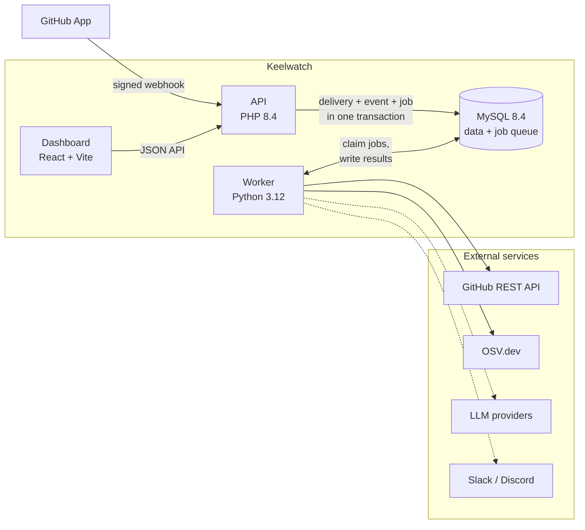
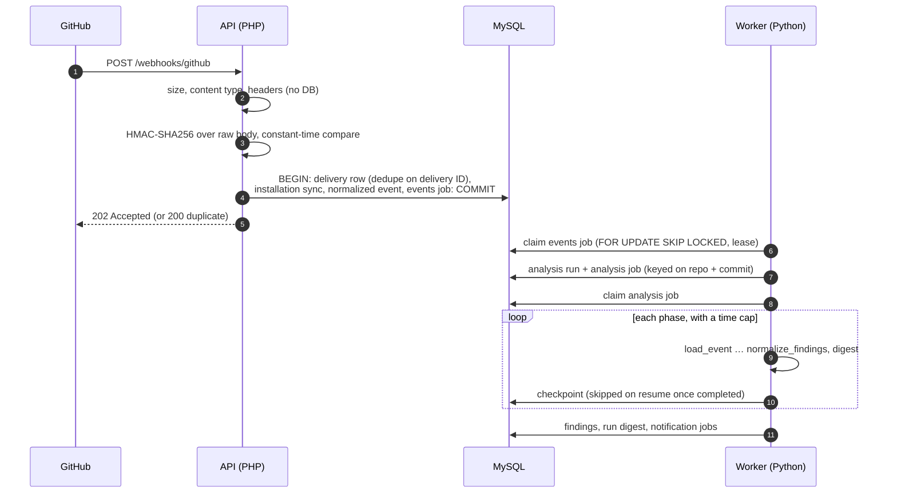
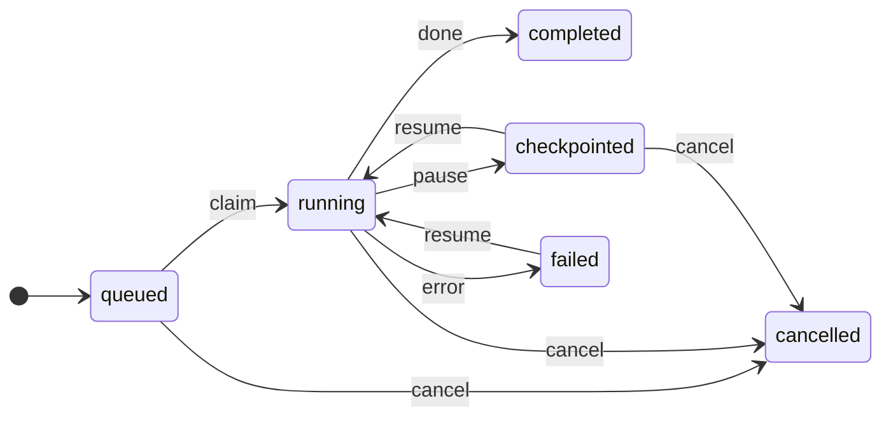
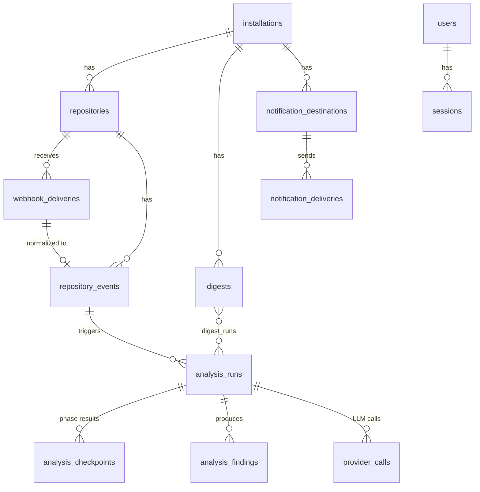

# Architecture

Keelwatch has three processes and one database. The API accepts GitHub
webhooks and serves the dashboard; the worker does all slow work; MySQL holds
both the data and the job queue. Why this shape instead of the brokers and
frameworks in the original specification is recorded in
[ADR 0001](adr/0001-stack.md).

Solid lines are always on; dotted lines are off until configured. The worker
fetches changed files from the GitHub API (no clone) and checks exact
dependency versions against OSV.dev; AI review is policy-gated and receives
only redacted context.

## Components

| Component | Code | Responsibility |
| --- | --- | --- |
| API | `api/src/` | Webhook ingestion (`Webhook/`), dashboard JSON API (`Dashboard/`), sign-in and sessions (`Auth/`), health (`Health/`), migrations (`Database/`). No framework; one front controller (`api/public/index.php`). |
| Worker | `worker/keelwatch_worker/` | Claims jobs from four queues, runs the analysis pipeline (`pipeline.py`, `intel/`), builds digests and sends notifications (`notify/`), writes heartbeats. No HTTP server. |
| Dashboard | `web/src/` | Single-page app behind sign-in. Plain CSS with design tokens, light and dark themes, every chart has a table view. |
| Database | `db/migrations/` | Numbered SQL migrations, applied only by the API (`php api/bin/migrate.php`). The worker never issues DDL. |
| Contracts | `contracts/` | JSON Schemas for everything that crosses the PHP/Python boundary, with valid and invalid fixtures that both test suites run. |

## Webhook to findings

The webhook request path does only what is needed to accept the delivery
safely; nothing slow happens before GitHub gets its response.

Key properties:

- **Enqueue is the commit.** The delivery, the normalized event and its job
  are written in one transaction, so there is no window where GitHub has a
  202 but the work exists only in memory or in a broker.
- **Idempotent at every step.** A repeated delivery ID returns `duplicate`;
  runs are keyed on repository + commit; each insert a job makes is keyed, so
  reprocessing a job cannot create a second run, finding set or notification.
- **At-least-once delivery, exactly-once effects in the database.** A job's
  results and its completion commit together. A crashed worker's lease
  expires and the job is retried or dead-lettered.
- **No raw payloads.** Only normalized fields are stored
  (`contracts/github-event.v1.json`); author emails are never stored.

## Analysis runs

Each run has a time budget. Phases run in order and checkpoint as they
finish, so a run interrupted by a rate limit, an outage or a restart resumes
where it stopped instead of starting over.

| Transition | When |
| --- | --- |
| claim | a worker claims the run's analysis job |
| pause | the time budget is used up, or a rate limit or outage should be retried later; completed phases are kept |
| resume | the job queue retries it, or someone resumes it from the dashboard (failed runs only from the dashboard) |
| error | a permanent error, or retries exhausted |
| cancel | someone cancels it from the dashboard |

| Phase | Output |
| --- | --- |
| `load_event` | The triggering event and repository |
| `extract_changes` | Changed files and patches from the GitHub API, secrets and emails masked before storage |
| `secrets` | Credentials, sensitive files and insecure patterns in added lines |
| `dependencies` | Manifest diffs (`package.json`, `composer.json`, `requirements*.txt`) and OSV.dev lookups for exact versions |
| `structure` | Change size, spread and test changes (heuristics, low confidence) |
| `context` | A bounded, redacted diff pack for the optional review |
| `llm_review` | Optional; only with a configured provider and a repository policy that allows it |
| `normalize_findings` | Findings with stable fingerprints, marked new or recurring |
| `digest` | The run digest, including a **gaps** list of anything not checked |

A gap is never reported as a clean result: an OSV outage reads "known-
vulnerability lookup was unavailable", not "no vulnerabilities".

## Queues

All four queues live in the `jobs` table and are claimed the same way.

| Queue | Job types | Enqueued by |
| --- | --- | --- |
| `events` | one per accepted delivery | API, in the webhook transaction |
| `analysis` | one per run (and per resume) | worker, from an event job or a dashboard resume |
| `notifications` | one per digest × matching destination | worker, after storing a digest |
| `scheduled` | `daily_digest` and other periodic work | worker, on its schedule |

Retries back off exponentially (with jitter) up to `max_attempts`, then the job is
dead-lettered and shown on System Health. Benchmarks for the claim path are
in [performance.md](performance.md).

## Data model

The main tables, simplified (see `db/migrations/` for every column and
constraint):

`jobs`, `worker_heartbeats`, `webhook_auth_failures` and `login_failures`
stand alone.

## Security boundaries

- **Webhook:** signature checked before any database read; failed checks
  are rate-limited per client; oversized or malformed requests are rejected
  first. Secret rotation is supported with `GITHUB_WEBHOOK_SECRET_PREVIOUS`.
- **Dashboard:** local accounts (Argon2id), server-side sessions with idle
  and absolute timeouts, CSRF tokens on every write, `admin` and `viewer`
  roles. Routes are private unless explicitly marked public, and a test pins
  the access level of every route.
- **Outbound:** only configured hosts over HTTPS; redirects refused or
  pinned; notification webhook URLs are exact-match validated, stored
  AES-256-GCM encrypted and never returned by the API.
- **AI review:** off unless configured; private repositories default to no
  AI; only redacted, bounded context is sent ([ADR 0003](adr/0003-llm-privacy-defaults.md)).
- **Output:** everything rendered is escaped by default ([ADR 0002](adr/0002-escape-by-default.md));
  notifications never contain code or evidence, and for private
  repositories contain no names or paths.

The audit of these boundaries, with evidence and accepted risks, is in
[security-audit.md](security-audit.md).

## Observability

- Structured JSON logs from the API and the worker, with credential-looking
  keys redacted before writing. A correlation ID follows a delivery from the
  webhook through its jobs and runs, and appears as "Reference" in the UI.
- `GET /healthz` (process up), `GET /readyz` (database reachable),
  `GET /api/system/health` (per-component status behind the System Health
  page), and `python -m keelwatch_worker --check` for the worker.
- Workers write a heartbeat row every `WORKER_HEARTBEAT_INTERVAL_S`; the API
  reports a worker stale after `WORKER_STALE_AFTER_S`.
