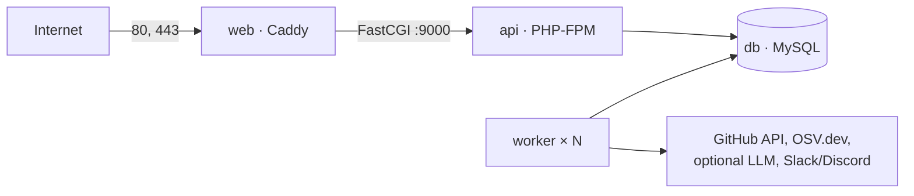

# Deployment

Keelwatch runs as five containers from one `compose.yaml`:

| Service | Image | Role |
| --- | --- | --- |
| `web` | Caddy + built dashboard | The only public service. HTTPS with automatic certificates, HTTP→HTTPS redirect, the dashboard, and FastCGI to `api` for `/api`, `/webhooks`, `/healthz` and `/readyz` |
| `api` | PHP 8.4-FPM | Webhook ingestion and the dashboard API |
| `worker` | Python 3.12 | Job queue, analysis, digests, notifications. Scales horizontally |
| `db` | MySQL 8.4 | Data and the job queue (volume `db-data`) |
| `migrate` | same as `api` | Applies migrations, then exits. `api` and `worker` start only after it succeeds |



## Requirements

- A Linux server with Docker Engine 24+ and the Compose plugin. 1 vCPU and
  2 GB RAM is enough for a single team; MySQL uses most of the memory.
- A domain name with an `A` (and optionally `AAAA`) record pointing at the
  server, and ports 80 and 443 open. Caddy needs both to obtain and renew
  Let's Encrypt certificates.
- Outbound HTTPS to `api.github.com`, `api.osv.dev`, Let's Encrypt, and any
  LLM or chat services you enable.

To try the stack on your own machine (including Docker Desktop on Windows or
macOS), leave `KEELWATCH_DOMAIN=localhost`; Caddy then issues a locally
trusted certificate instead of contacting Let's Encrypt.

## First deployment

1. **Get the code.**

   ```bash
   git clone https://github.com/fazal305/keelwatch.git && cd keelwatch
   cp .env.example .env
   chmod 600 .env
   ```

2. **Fill in `.env`.** At minimum:

   | Setting | Value |
   | --- | --- |
   | `APP_ENV` | `production` |
   | `SESSION_COOKIE_SECURE` | `true` (the example's `false` is for plain-HTTP development and is refused in production) |
   | `KEELWATCH_DOMAIN` | your host name, e.g. `keelwatch.example.com` |
   | `DB_PASSWORD`, `MYSQL_ROOT_PASSWORD` | two different long random values |
   | `APP_SECRET` | 64 hex characters |
   | `GITHUB_WEBHOOK_SECRET` | 64 hex characters; the same value goes into the GitHub App |
   | `NOTIFICATION_KEY` | optional; 32 random bytes, base64 (enables Slack/Discord) |
   | `DASHBOARD_URL` | optional; `https://<your domain>` for links in notifications |

   Generate the random values with:

   ```bash
   openssl rand -hex 24                              # passwords
   openssl rand -hex 32                              # APP_SECRET, GITHUB_WEBHOOK_SECRET
   openssl rand -base64 32                           # NOTIFICATION_KEY
   ```

   Leave `DB_HOST` as it is: Compose points the services at the `db`
   container. `DB_NAME`, `DB_USER` and `DB_PASSWORD` create the database and
   its user on first start; changing them later does not change an existing
   database.

3. **Start the stack.** The first build takes a few minutes.

   ```bash
   docker compose up -d --build
   docker compose ps
   ```

   `migrate` should show `Exited (0)` and the others `running`, with `db` and
   `worker` `(healthy)`.

4. **Create the first administrator.** The password is printed once.

   ```bash
   docker compose run --rm api php api/bin/user.php create admin --role=admin
   ```

5. **Check it.**

   ```bash
   curl -fsS https://<your domain>/readyz       # {"status":"ready",...}
   ```

   Then sign in at `https://<your domain>` and open **System health**: API,
   database, workers and queue should all be operational.

6. **Connect GitHub.** Create the GitHub App as described in the
   [README](../README.md#connecting-github), with the webhook URL
   `https://<your domain>/webhooks/github`. GitHub sends a `ping` when the
   app is saved; it appears in `docker compose logs api`.

   To analyse private repositories (or avoid the anonymous rate limit), save
   the app's private key as `secrets/github-app.pem` next to `compose.yaml`
   and set:

   ```bash
   GITHUB_APP_ID=123456
   GITHUB_APP_PRIVATE_KEY_PATH=/run/secrets/keelwatch/github-app.pem
   ```

   The `secrets/` directory is mounted read-only into the worker only, and is
   ignored by git. Make the key readable by the worker's user (uid 10001) and
   nobody else, then restart the worker:

   ```bash
   sudo chown 10001:10001 secrets/github-app.pem && sudo chmod 400 secrets/github-app.pem
   docker compose up -d worker
   ```

## Operations

### Logs

All services log to stdout as JSON, rotated by Docker (10 MB × 5 files per
container).

```bash
docker compose logs -f api worker            # follow
docker compose logs --since 1h worker | grep '"level": "error"'
```

A correlation ID (`correlation_id`) follows a delivery through its jobs and
runs; the dashboard shows it as "Reference" in error messages.

### Upgrades

```bash
git pull
deploy/backup.sh                             # always back up first
docker compose up -d --build
```

`migrate` runs before the new `api` and `worker` start, and they are not
started if it fails. In that case check `docker compose logs migrate`, then
fix the cause and run `docker compose up -d` again, or roll back with
`git checkout <previous tag>` and `deploy/restore.sh`.

### Scaling workers

```bash
docker compose up -d --scale worker=3
```

Workers coordinate through the database (`SKIP LOCKED` claims and leases), so
any number can run. Benchmarks for the claim path are in
[performance.md](performance.md).

### Backups and restore

```bash
deploy/backup.sh                             # → backups/keelwatch-<UTC time>.sql.gz
deploy/restore.sh backups/keelwatch-20261002T060000Z.sql.gz
```

`backup.sh` takes a consistent dump with `--single-transaction` while the
stack runs, and writes files readable only by you. `restore.sh` asks for
confirmation, stops `web`, `api` and `worker`, replaces the data, and starts
everything again (re-running migrations).

Schedule daily backups and copy them off the server, for example:

```cron
15 3 * * * cd /opt/keelwatch && deploy/backup.sh >/dev/null && find backups -name '*.sql.gz' -mtime +14 -delete
```

Back up `.env` and `secrets/` separately and securely: without
`NOTIFICATION_KEY` the stored Slack/Discord URLs cannot be decrypted.

### Rotating secrets

| Secret | How |
| --- | --- |
| `GITHUB_WEBHOOK_SECRET` | Move the current value to `GITHUB_WEBHOOK_SECRET_PREVIOUS`, set the new one, `docker compose up -d api`, update the GitHub App, then clear the previous value |
| `APP_SECRET` | Set a new value and `docker compose up -d api`; login throttling counters reset |
| `DB_PASSWORD` | Change it in MySQL (`ALTER USER`), then in `.env`, then `docker compose up -d` |
| `NOTIFICATION_KEY` | Changing it makes stored destinations unreadable; re-add them afterwards |
| Admin password | `docker compose run --rm api php api/bin/user.php reset-password <username>` |

### Health checks

| Check | Use |
| --- | --- |
| `GET /healthz` | Liveness: the API process answers |
| `GET /readyz` | Readiness: 503 while the database is unreachable |
| `docker compose ps` | Container health; the worker's check runs `python -m keelwatch_worker --check` |
| System health page | Per-component status, worker heartbeats, queue lag and dead-lettered jobs |

Point an external uptime monitor at `/readyz`.

## Security notes

- Only `web` publishes ports. `api`, `worker` and `db` are reachable only on
  the Compose network.
- `api` runs as `www-data` and `worker` as an unprivileged user; neither
  receives the MySQL root password.
- With `APP_ENV=production`, session cookies are `Secure` and `__Host-`
  prefixed, and internal timing headers are not sent.
- Caddy adds HSTS and a strict Content-Security-Policy for the dashboard
  (`script-src 'self'`, no inline code); the API sets its own stricter headers.
- The webhook rate limiter uses the client address Caddy passes over FastCGI.
  If you put another proxy or CDN in front of Caddy, every request will
  appear to come from that proxy, so failed-signature limits apply to it as
  a whole.

More in [SECURITY.md](../SECURITY.md) and [security-audit.md](security-audit.md).

## Troubleshooting

| Symptom | Check |
| --- | --- |
| `migrate` exits non-zero | `docker compose logs migrate`; usually wrong `DB_*` values, or a database created with different credentials (the `db-data` volume keeps the first ones) |
| `db` restarts with `MYSQL_USER="root"` or settings seem ignored | Docker Compose prefers variables exported in your shell over `.env`; `unset` them (e.g. `DB_USER`) or run from a clean shell |
| Browser certificate error | DNS must point at the server and ports 80/443 must be reachable; see `docker compose logs web` |
| `/readyz` returns 503 | `docker compose ps db` and `docker compose logs db` |
| GitHub shows webhook failures | 401: the secret in the app differs from `GITHUB_WEBHOOK_SECRET`; 415: set the app's content type to `application/json` |
| Runs stay `checkpointed` with `retry_later:extract_changes` | The GitHub API rate limit; set `GITHUB_APP_ID` and the private key (see step 6) |
| Queue shows *degraded* | Jobs have waited longer than `QUEUE_LAG_WARN_S`; add workers or check `docker compose logs worker` |

## Verified behaviour

The stack in this repository was brought up from scratch and checked end to
end on 2026-10-02 (Linux, 4 vCPU, Docker 29, `KEELWATCH_DOMAIN=localhost`):

- migrations applied by `migrate`; `api` and `worker` started only afterwards;
- signed webhooks through Caddy returned 202, a bad signature 401; the worker
  created analysis runs, and a GitHub rate limit checkpointed a run for
  retry instead of failing it;
- 300 signed webhooks: all 202, client round trip p50 8.5 ms, p95 11.6 ms over
  loopback HTTPS (network latency to a real server comes on top);
- dashboard sign-in and every page in Chromium with no CSP violations; the
  session cookie was `__Host-`, `Secure`, `HttpOnly`, `SameSite=Strict`;
- stopping `db`: `/readyz` 503 while `/healthz` stayed 200; recovery within
  about 4 s of restart, the worker reconnected without restarting;
- `backup.sh` → deleted data → `restore.sh`: all rows back, stack healthy;
- `--scale worker=2`: both workers healthy.

Not yet verified: a public domain with Let's Encrypt certificates, and
long-running operation.
